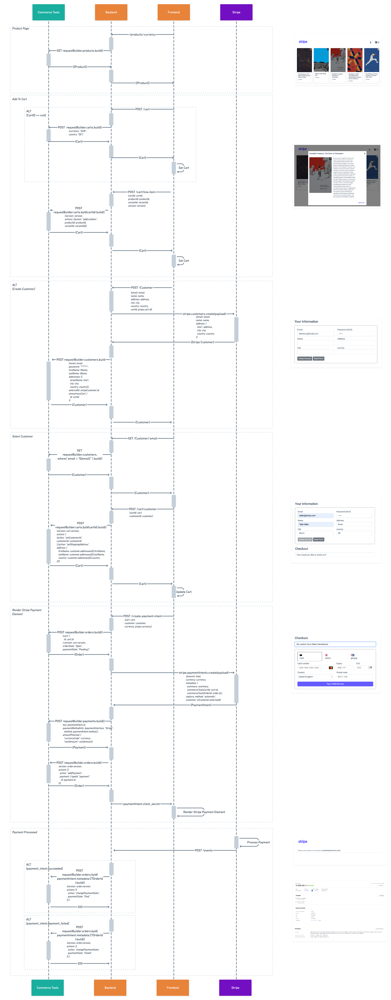
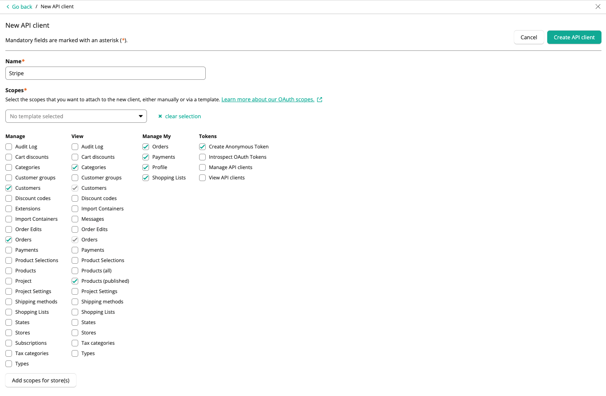

# e-Commerce example integrated with CommerceTools and Stripe


The application provides a basic e-commerce site integrated with CommerceTools and Stripe. This is pulling a product catalog directly from Commercetools and taking advantage of Commercetools’s cart API when a user adds a new item to a cart. Further to this a customer object can be created via stripe, once created a customer can be created in Commercetools providing an external_id linked the stripe customer’s ID, this allows the site to track the customer both on API’s.

When a user chooses to checkout the e-commerce site will create both a Stripe PaymentIntent and Commercetools Order using the details from the cart, the PaymentIntent will include the Commercetools CartID and OrderID as metadata. The user can now be presented with either Stripe Elements or Stripe Checkout to complete the transaction. A Stripe Webhook will send succeeded or payment_failed to the e-commerce site. The e-commerce site will then process the event and update the Commercetools order status accordingly, getting the order_id from the PaymentIntent’s metadata.

**Stripe technologies included in this demo:**

1. Hosted Checkout page
1. Universal Payment Element (EUR - cards, iDEAL, SoFort, Giropay)

## Installation

```bash
npm install
```

## Running Locally

Then to start the app, run the following from the _root_ directory:

```bash
npm run build
npm start
```

## Update .env with

When running locally copy `/.env-sample` to `/.env` **and** `/client/.env-sample` to `/client/.env` and update with your details

```bash
cp .env-sample .env
cp client/.env-sample client/.env
```

| Variable                 | Description               | Example                                         |
| ------------------------ | ------------------------- | ----------------------------------------------- |
| REACT_APP_PK             | Stripe Public Key         | pk*test*\*\*\*\*                                |
| REACT_APP_SK             | Stripe Private Key        | sk*test*\*\*\*\*                                |
| REACT_APP_ADMIN          | Stripe Account ID         | actt\_\*\*\*\*                                  |
| REACT_APP_PORT           | Port to run the server    | 8081                                            |
| REACT_APP_BASE_URL       | Base URL of the server    | http://localhost:8081                           |
| REACT_APP_CT_PROJECT_KEY | CommerceTools Project Key | **\***                                          |
| REACT_APP_CT_CLIENT_ID   | CommerceTools Client ID   | **\***                                          |
| REACT_APP_CT_SECRET      | CommerceTools Secret Key  | **\***                                          |
| REACT_APP_CT_API_URL     | CommerceTools API URL     | https://api.europe-west1.gcp.commercetools.com  |
| REACT_APP_CT_AUTH_URL    | CommerceTools Auth URL    | https://auth.europe-west1.gcp.commercetools.com |

# Webhooks

This example used webhooks to handel payment's asynchronously, an Stripe webhook will be configured when starting the sever which will use the `REACT_APP_BASE_URL` configured in the .env file.

## Testing Webhooks

You can test your webhook endpoint using the Stripe CLI, or by making your webhook endpoint (URL) publicly accessible and registering it with Stripe to run tests.

To install the Stripe CLI with homebrew, run:

```bash
brew install stripe/stripe-cli/stripe
```

To install the Stripe CLI on Windows without Scoop:

1. Download the latest `windows` tar.gz file from [here](https://github.com/stripe/stripe-cli/releases/latest)
2. Unzip the `stripe_X.X.X_windows_x86_64.zip` file
3. Run the unzipped `.exe` file

After installing the Stripe CLI, pair it with your Stripe account by running stripe login in the terminal. You’ll be prompted to log in to the Stripe Dashboard to grant the Stripe CLI access to your account.

```bash
$ stripe login
```

Pairing generates a pair of secret API keys - one test mode, one live mode - that are valid for 90 days.

After linking your Stripe account, you can use the Stripe CLI to listen for events via stripe listen. But to test your endpoint, you’ll want to forward received events to your server. Do so by adding the --forward-to flag when invoking stripe listen:

```bash
stripe listen --forward-to http://127.0.0.1:8081/events
```

more details can be found [here](https://stripe.com/docs/webhooks/test)

---

## Webhooks Details [OPTIONAL]

You can register up to 16 webhook endpoints with Stripe. To register your webhook endpoint, provide the publicly accessible HTTPS URL to your webhook endpoint, and select the type of events you’re receiving in your endpoint. The URL format to register a webhook endpoint is:

```
https://<your-website>/events
```

For example, if your domain is `https://mycompanysite.com` specify `https://mycompanysite.com/events` as the endpoint URL.

## Add a webhook endpoint [OPTIONAL]

Use the following steps to register a webhook endpoint in the Developers Dashboard.

Open the [Webhooks](https://dashboard.stripe.com/webhooks) page.
Click Add endpoint.
Add your webhook endpoint’s HTTPS URL in Endpoint URL.
If you have a Stripe Connect account, enter a description and select Listen to events on Connected accounts.
Select the events **Payment Intent**>**Select All**.
Click Add endpoint.

# Sequence Diagram

Below is a detailed sequence diagram of the calls used in this example:


# Commerce Tools

When creating a new API client you will need to set the following Scopes:

### Manage

- Customers
- Orders
- Payments
- Products

### View

- Categories
- Customers
- Orders
- Payments
- Products (all)
- Products (published)

### Manage My

- Orders
- Payments
- Profile
- Shopping Lists

### Tokens

- Create Anonymous Token


